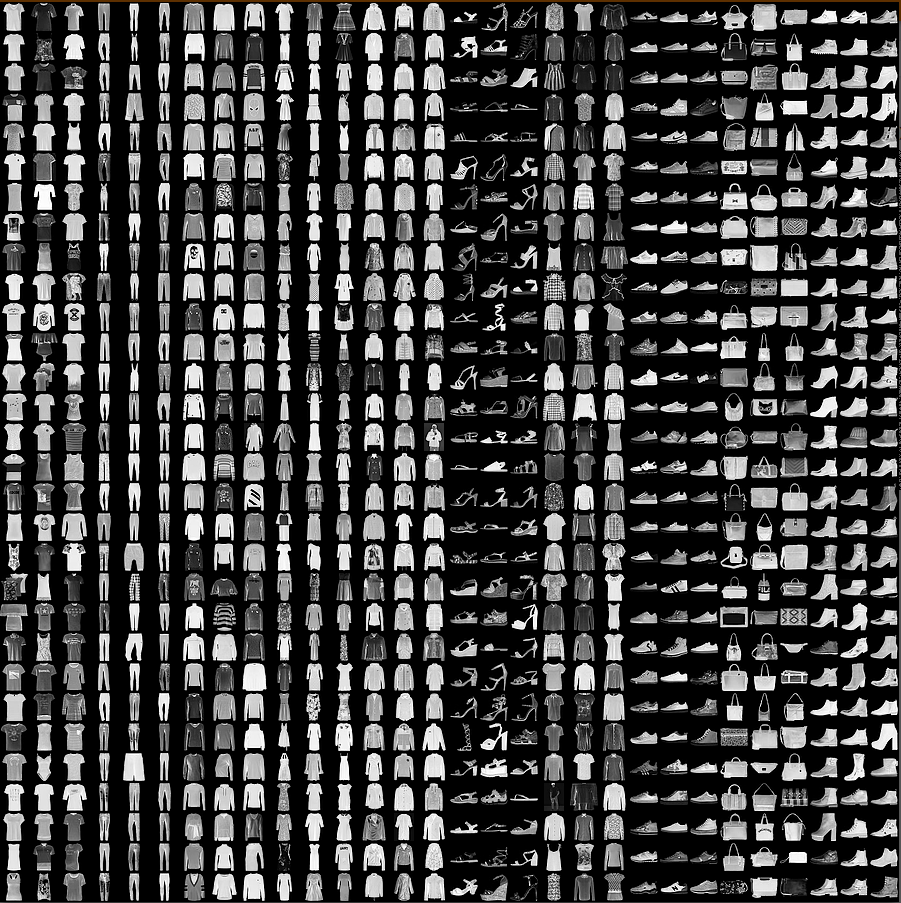

# fashion-mnist-project
A Pytorch Convolution Neural Network Model trained on Fashion-MNIST

## Fashion-MNIST

Fashion-MNIST is a benchmark for machine learning consisting of 60,000 training examples and 10,000 testing examples.
Each is a grayscale 28x28 image of a clothing article and is labeled with one of 10 classes.

Example of data:



## Model

This model uses the `TinyVGG` architecture consisting of 2 convolutional blocks both with max pooling, followed by a
classifier.

The model has a test accuracy of **88.1%** and a training time of ***35 seconds** on a Nvidia T4 GPU.

Here is the model evaluated using a confusion matrix on the 10,000 testing samples:


## Usage

Git `clone` the repository, or download just `FashionMNISTCNNModel.pth` and the Jupyter Notebook, `fashion-mnist-project.ipynb`.

In your code instantiate the class `FashionMNISTModel2` as shown in the Jupyter Notebook.

Then where `MODEL_SAVE_PATH` is where the model is saved in your system, use this code:

```python
model = FashionMNISTModel2(input_shape=1, hidden_units = 10, output_shape=10)
model.load_state_dict(torch.load(f=MODEL_SAVE_PATH))
```
